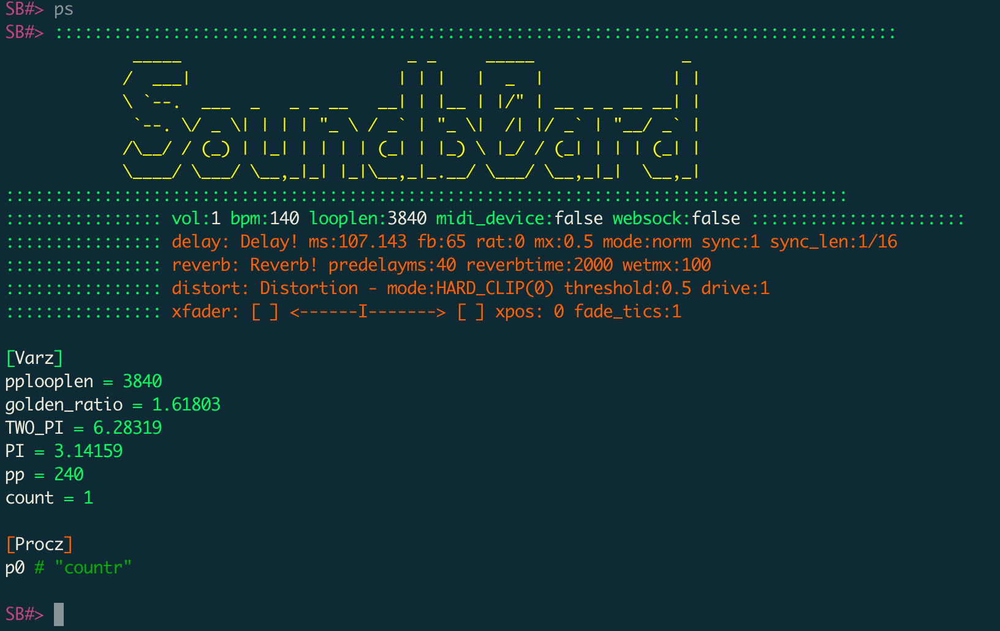
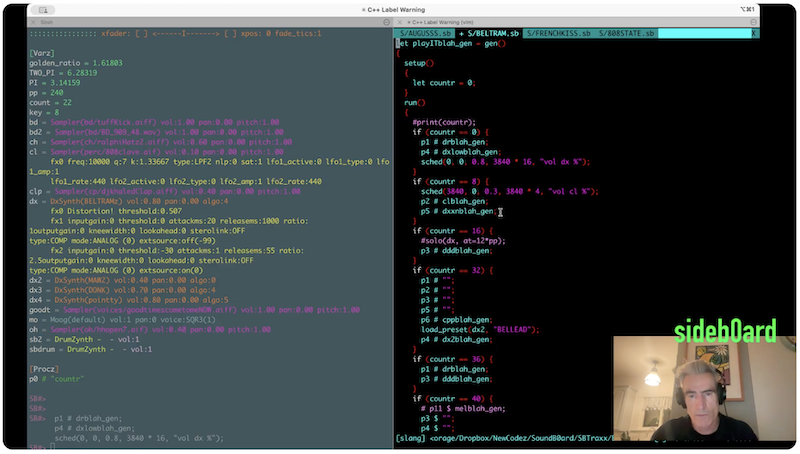

# Soundb0ard Shell

```

 _____                       _ _     _____               _
/  ___|                     | | |   |  _  |             | |
\ `--.  ___  _   _ _ __   __| | |__ | |/' | __ _ _ __ __| |
 `--. \/ _ \| | | | '_ \ / _` | '_ \|  /| |/ _` | '__/ _` |
/\__/ / (_) | |_| | | | | (_| | |_) \ |_/ / (_| | | | (_| |
\____/ \___/ \__,_|_| |_|\__,_|_.__/ \___/ \__,_|_|  \__,_|

```

SoundB0ard is a text based interactive music-making environment. It is a programming language with inbuilt Sound Generators - FM synth, subtractive synth, drum machine and sampler and the means to control those sound generators over time.

 

### Key Features
- Unix-style shell for interactive control of the system.
- Slang language, javascript like syntax.
- Live coding support - can track files for changes 
- Ableton Link integration for tempo synchronization across apps
- FM and subtractive synth engines, based on DX100 and MiniMoog.
- Drum synthesis and Sampler
- Granular synthesis
- FX processing
- MIDI support
- WebSocket integration for remote control

## Technology Stack

- **Language**: C++20
- **Build System**: CMake
- **Platform**: macOS (primary), Linux (cross-platform capable)
- **Audio I/O**: PortAudio
- **MIDI I/O**: PortMidi
- **File I/O**: libsndfile
- **CLI**: readline
- **Sync**: Ableton Link
- **JSON**: JsonCpp
- **WebSockets**: websocketpp

## Architecture

### Synthesis Engines

- **FMSynth** (`fmsynth.cpp/h`): FM-style synthesis engine
- **MiniSynth** (`minisynth.cpp/h`): Subtractive synthesis engine
- **SBSynth** (`sbsynth.cpp/h`): Custom synthesis engine
- **DrumSynth** (`drum_synth.cpp/h`): Drum synthesis
- **DrumSampler** (`drumsampler.cpp/h`): Sample-based drums

## Build & Development

### Building
```bash
./install_deps.sh    # Install dependencies
mkdir build && cd build
cmake ..
cmake --build . -j$(nproc)
cd ..
```

### Running
```bash
# Run from project root (so it can find wavs/ directory)
build/Sbsh
```

## Code Style & Conventions

- **Standard**: C++20
- **Formatting**: clang-format (config in `.clang-format`)
- **Linting**: clang-tidy (config in `.clang-tidy`)
- **Pre-commit hooks**: Configured in `.pre-commit-config.yaml`

## Project Structure

```
SoundB0ard/
├── src/              # Source code
│   ├── filters/      # Filter implementations
│   ├── fx/           # Effects processors
│   ├── interpreter/  # Command interpreter
│   ├── pattern_parser/ # Pattern language
│   └── websocket/    # WebSocket server
├── tests/            # Test suite
├── wavs/             # Sample library
├── SBTraxx/          # Track/pattern files
├── settings/         # Synth presets
├── build/            # Build output
└── cmake/            # CMake modules
```

## Additional Resources

- [Build instructions](BUILD.md)
- [User Guide](USER_GUIDE.md)
- [Credits](CREDITS.md)

[](https://www.youtube.com/watch?v=RbzhaLBoXVY)

