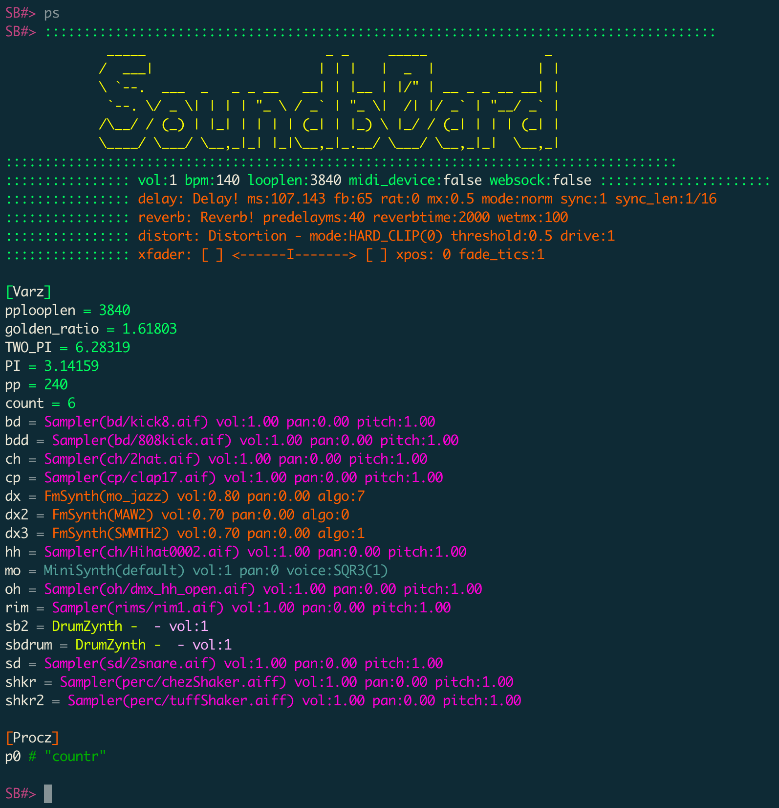
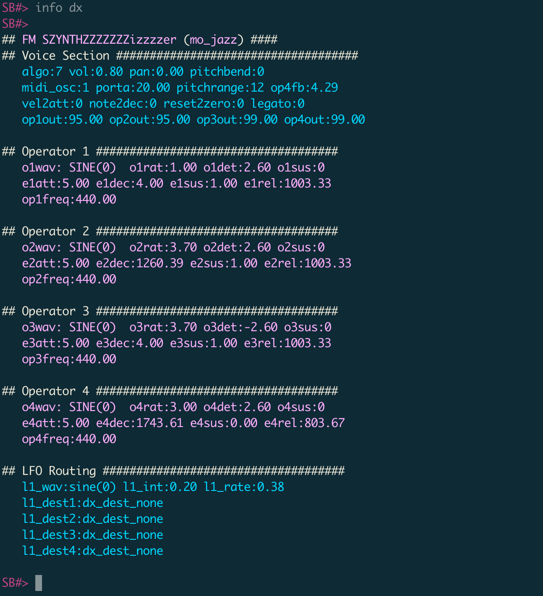
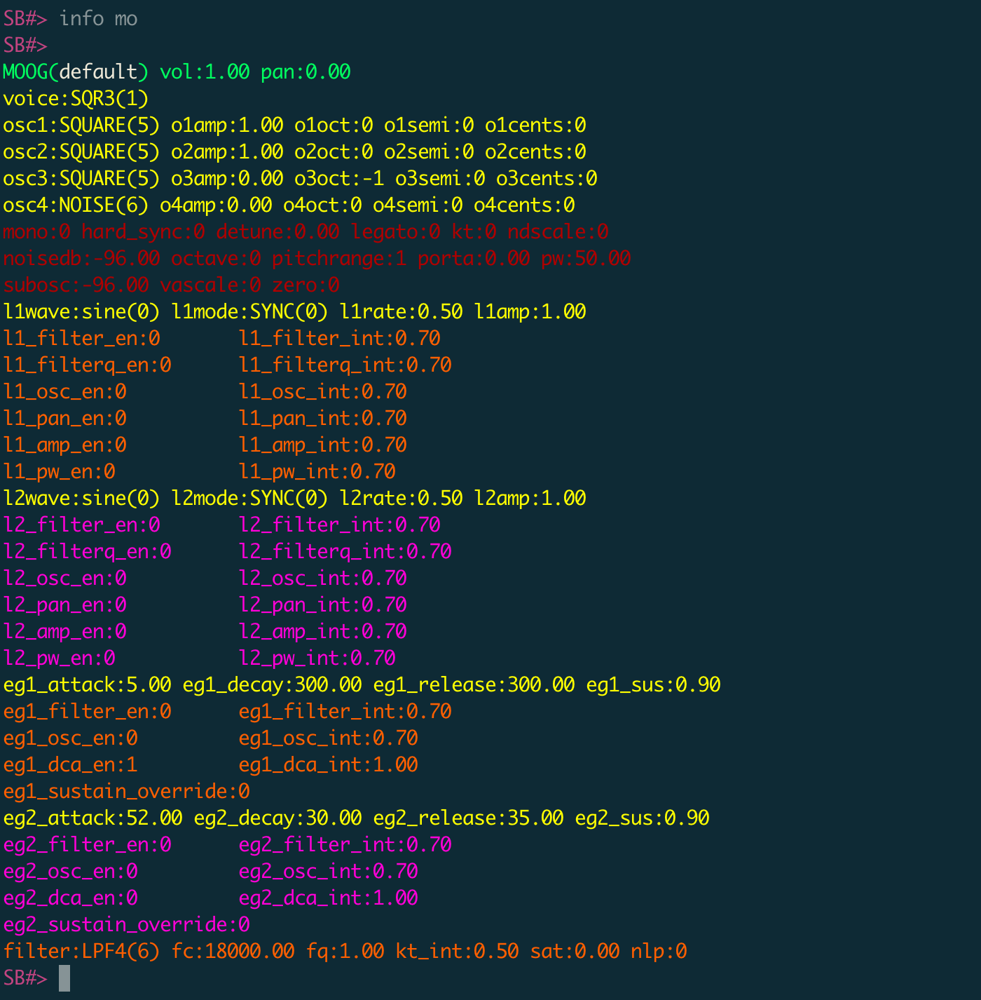
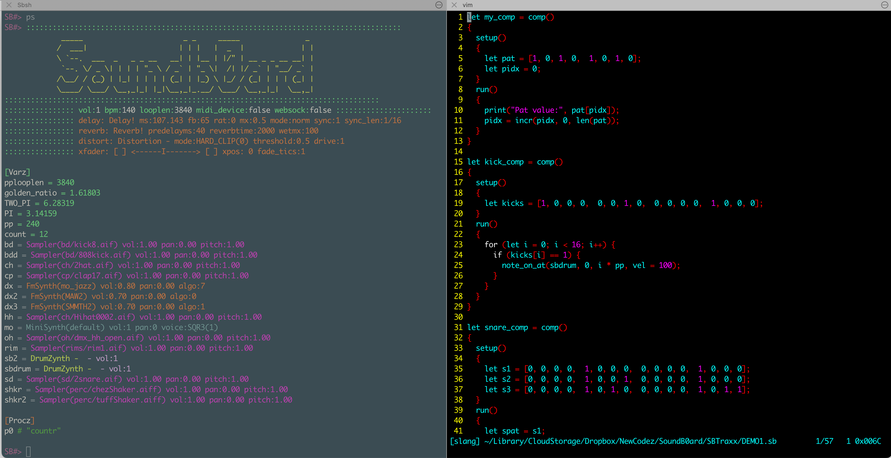

# SBShell User Guide

> **[⬇ Source Code on Codeberg](https://codeberg.org/sideb0ard/SBShell)**

<iframe width="100%" height="315"
  src="https://www.youtube.com/embed/CE3KD_9QHqI"
  frameborder="0" allowfullscreen style="border:1px solid #1e1e1e; border-radius:4px; margin:16px 0;">
</iframe>

Soundb0ard Shell is my Unix shell inspired music making environment. Rather than being the shell around an operating system, it is a shell around an audio mixing desk with several music instruments - FM synth, subtractive synth, drum synth, granular looper, and one-shot sample player. You control the shell via a javascript-like programming language called Slang.

Once launched from the command line, you enter an interactive shell where you can type commands. The color scheme is designed for a dark terminal.

Once you have successfully followed the [BUILD](BUILD.md) instructions, you launch it from the projet root with:
```bash
build/Sbsh
```

---

## 0. Where am i?

After running `build/Sbsh` you should find yourself at an `SB#>` prompt where you can start typing. You're goto command is `ps`. In Unix this would be 'process status', for SBShell, it's more like 'program status' - it shows you mixer stats like volume and BPM; it shows you environment variables, which can be standard objects like numbers, strings and booleans, and also its special sauce --  sound generator objects like FMSynth, MiniSynth, DrumSynth, or Sampler; and it shows the running Processes. More about all of that below..

## 1. Code syntax

Slang is based upon [Monkey](https://monkeylang.org/) and all monkey code should be valid. e.g.

```
// Integers & arithmetic expressions...
let version = 1 + (50 / 2) - (8 * 3);

// ... and strings
let name = "The SBShell Programming Language - Slang!";

// ... booleans
let audioProgrammingFun = true;

// ... arrays & hash maps
let pals = [{"name": "Kenny", "age": 53}, {"name": "Pat", "age": 51}];

// User-defined functions...
let getName = fn(person) { person["name"]; };
getName(pals[0]); // => "Kenny"
getName(pals[1]); // => "Pat"

print(len(pals)); // prints: 2

let fibonacci = fn(x) {
  if (x == 0) {
    0
  } else {
    if (x == 1) {
      return 1;
    } else {
      fibonacci(x - 1) + fibonacci(x - 2);
    }
  }
};

fibonnaci(14); // => 377

// `newAdder` returns a closure that makes use of the free variables `a` and `b`:
let newAdder = fn(a, b) {
    fn(c) { a + b + c };
};
// This constructs a new `adder` function:
let adder = newAdder(1, 2);

adder(8); // => 11
```

## 2. Audio! Sound Generators

Ok! How do i make noise?!

```javascript
// whats going on?
ps
```

 

```javascript
// you'll see various synths already created in the environment.
// such as 'dx', 'dx2', 'dx3' - these are instances of the DX Synth,
// 'mo' the MiniSynth, and 'sbdrum', 'sb2', both drum machine instances,
// plus several one-shot sample players with names like 'bd', bdd', 'cp', 'sn'
// This is my default setup but you can create as many of these sound
// generators as you like.
```

Lets try a DX synth first.

All sound generators can be triggered via the `note_on(..)` function, which takes a sound generator for the first param and a MIDI note for the second param.

```javascript
note_on(dx, 44);

// try a chord
note_on(dx, [44, 48, 51]);
```

\ Um, ok, i have no idea what those numbers are? 
/ Soundb0ard deals directly with MIDI numbers. There is a built-in guide you can print with `midi_ref()`

```javascript
SB#> midi_ref()
SB#> Midi Note Reference
------------------------------------------------------------------------
 - C:0 C#:1 D:2 D#:3 E:4 F:5 F#:6 G:7 G#:8 A:9 A#:10 B:11
 0 C:12 C#:13 D:14 D#:15 E:16 F:17 F#:18 G:19 G#:20 A:21 A#:22 B:23
 1 C:24 C#:25 D:26 D#:27 E:28 F:29 F#:30 G:31 G#:32 A:33 A#:34 B:35
 2 C:36 C#:37 D:38 D#:39 E:40 F:41 F#:42 G:43 G#:44 A:45 A#:46 B:47
 3 C:48 C#:49 D:50 D#:51 E:52 F:53 F#:54 G:55 G#:56 A:57 A#:58 B:59
 4 C:60 C#:61 D:62 D#:63 E:64 F:65 F#:66 G:67 G#:68 A:69 A#:70 B:71
 5 C:72 C#:73 D:74 D#:75 E:76 F:77 F#:78 G:79 G#:80 A:81 A#:82 B:83
```

and lots of built in functions for using midi numbers:
```javascript
SB#> notes_in_key(44)
SB#> [44, 46, 48, 49,  51, 53, 55, 56]
print_notes(notes_in_key(44))
SB#> Notes:[44, 46, 48, 49,  51, 53, 55, 56]
G# A# C C# D# F G G#
print_notes(notes_in_key(44, 1))
SB#> Notes:[44, 46, 47, 49,  51, 52, 54, 56]
G# A# B C# D# E F# G#
notes_in_chord(44, 44)
SB#> [44, 48, 51]
SB#> note_on(dx, notes_in_chord(44, 44))
```

`chord_notes(root, type, mod)` builds a chord from intervals only — no key needed. Useful when you know the chord but not the key:
```javascript
# type: 0=major  1=minor  2=diminished  3=power  4=sus2  5=sus4
# mod:  0=triad  1=min7   2=maj7        3=inv_min7        4=inv_maj7

chord_notes(51)           # D# major triad
SB#> [51, 55, 58]
chord_notes(51, 1)        # D# minor triad
SB#> [51, 54, 58]
chord_notes(51, 1, 1)     # D# minor 7
SB#> [51, 54, 58, 61]
chord_notes(56, 1, 1)     # G# minor 7
SB#> [56, 59, 63, 66]

# Play a D# min7 > G# min7 progression:
note_on(dx, chord_notes(51, 1, 1), dur=1000)
note_on_at(dx, chord_notes(56, 1, 1), 1000, dur=1000)
```

Try some other DX synth:

```javascript
SB#> note_on(dx2, 24, dur=700) // C
SB#> note_on(dx2, 26, dur=1700)

SB#> note_on(dx3, 69, dur=200)
SB#> note_on(dx3, 74, dur=2700)
```

### FM Synth - fmsynth()

View the DX parameters via:
```javascript
SB#> info dx
## FM SZYNTHZZZZZZZizzzzer (LOUIS) ####
## Voice Section ####################################
   algo:0 vol:0.80 pan:0.00 pitchbend:0
   midi_osc:1 porta:0.00 pitchrange:12 op4fb:4.29
   vel2att:0 note2dec:0 reset2zero:0 legato:0
   op1out:95.00 op2out:70.00 op3out:50.00 op4out:0.00

## Operator 1 ####################################
   o1wav: SINE(0)  o1rat:1.00 o1det:0.00 o1sus:0
   e1att:5.00 e1dec:4.00 e1sus:0.30 e1rel:200.00
   op1freq:103.83

## Operator 2 ####################################
   o2wav: SINE(0)  o2rat:3.00 o2det:0.00 o2sus:0
   e2att:11.00 e2dec:400.00 e2sus:1.00 e2rel:1003.33
   op2freq:103.83

## Operator 3 ####################################
   o3wav: SINE(0)  o3rat:4.00 o3det:0.00 o3sus:0
   e3att:100.00 e3dec:4.00 e3sus:0.20 e3rel:1003.33
   op3freq:103.83

## Operator 4 ####################################
   o4wav: SINE(0)  o4rat:3.00 o4det:2.60 o4sus:0
   e4att:5.00 e4dec:1743.61 e4sus:0.00 e4rel:803.67
   op4freq:103.83

## LFO Routing ####################################
   l1_wav:sine(0) l1_int:0.20 l1_rate:0.38
   l1_dest1:dx_dest_none
   l1_dest2:dx_dest_none
   l1_dest3:dx_dest_none
   l1_dest4:dx_dest_none

SB#>
```

All the paramaters can be changed via the following syntax:
`set <sound_generator_name>:<param_name> val`;
e.g. `set dx:o2rat 4.7`

How the operators are connected is controlled via the `algo`. You can view an ASCII diagram of them via the command `algoz()`:

```javascript
SB#> algoz()
SB#> DX Algos:
  0.    1.    2.      3.    4.     5.        6.        7.

  4
  |
  3     3 4   3       4
  |     \ |   |       |
  2       2   2 4   2 3   2  4      4            4
  |       |   |/    |/    |  |    / | \          |
  1       1   1     1     1__3   1__2__3   1__2__3   1__2__3__4
```

The bottom row are the operators sent to the DCA. E.g. in `algo` 0, Op1 is being sent to the output, Op2 is modulating op1, op3 is modulating op2, op3 is mod'ing op4; whereas `algo` 7 all the operators are being sent to the output, i.e pure addictive synth.


```javascript
// Trigger a kick drum on a drum synth    (note 0)
note_on(sbdrum, 0);

// clap (note 2)
note_on(sbdrum, 2);

// what else?
info sbdrum;

// bd(0) // sd(1) // cp(2) // hh(3) // hh2(4) ..

// play a long bass note on an FM Synth (midi 20 - G#)
note_on(dx, 20, dur = 5000);
```


```javascript
// Load a preset
load_preset(sbdrum, "TR808");
note_on(sbdrum, 0);

// Try different velocities (0-127)
note_on(sbdrum, 1, vel = 127);  // Loud snare
note_on(sbdrum, 1, vel = 40);   // Quiet ghost note

```

---

## 2. Sound Generators

SoundB0ard has five types of sound generators:

### Drum Machine - drum()
Synthesized drums with 9 voices: kick, snare, closed hat, clap, open hat, 3 FM toms, and a laser zap.

```javascript
let drums = drum();
load_preset(drums, "TR808");   // Classic 808
load_preset(drums, "TR909");   // Punchy 909
load_preset(drums, "DILLA");   // Warm, lo-fi

list_presets(drums); // to see all presets
save_preset(drums, "NEWPRESETNAME"); // to save a new preset

// Drum voices (MIDI note numbers):
// 0 = Kick
// 1 = Snare
// 2 = Clap
// 3 = Closed Hi-Hat
// 4 = Open Hi-Hat
// 5-7 = FM Toms
// 8 = Laser
```

### FM Synth - fmsynth()
4-operator FM synthesis for bells, bass, keys, and experimental sounds.

```javascript
let dx1 = fmsynth();
load_preset(dx1, "BASS");
note_on(dx1, 36);  // C1 - deep bass note
note_on(dx1, 60);  // C3 - middle C
note_on(dx1, notes_in_chord(40, 36)); // play a E(40) chord in the key of C(36)

midi_ref(); // midi note reference and other info
Midi Notes:
- C:0  C#:1  D:2  D#:3  E:4  F:5  F#:6  G:7  G#:8  A:9  A#:10 B:11
0 C:12 C#:13 D:14 D#:15 E:16 F:17 F#:18 G:19 G#:20 A:21 A#:22 B:23
1 C:24 C#:25 D:26 D#:27 E:28 F:29 F#:30 G:31 G#:32 A:33 A#:34 B:35
2 C:36 C#:37 D:38 D#:39 E:40 F:41 F#:42 G:43 G#:44 A:45 A#:46 B:47
3 C:48 C#:49 D:50 D#:51 E:52 F:53 F#:54 G:55 G#:56 A:57 A#:58 B:59
4 C:60 C#:61 D:62 D#:63 E:64 F:65 F#:66 G:67 G#:68 A:69 A#:70 B:71
5 C:72 C#:73 D:74 D#:75 E:76 F:77 F#:78 G:79 G#:80 A:81 A#:82 B:83
Chord Progressions: I-IV-V, I-V-vi-IV, I-vi-IV-V, vi-ii-V-I vi-IV-I-V
Chord Mods: None(0), Seventh(1), Seventh Inv(2) Root Inv(3) Power(4)
Key Mods: None(0), Natural Minor(1), Harmonic Minor Inv(2) Melodic Minor(3) Phrygian(4)
Filters: LPF1, HPF1, LPF2, HPF2, BPF2, BSF2, LPF4, HPF4, BPF4
Major Scale: W W H W W W H // Minor Scale: W H W W H W W

SB#> notes_in_key(36)
SB#> [36, 38, 40, 41,  43, 45, 47, 48]
print_notes(notes_in_key(36))
SB#> Notes:[36, 38, 40, 41,  43, 45, 47, 48]
C D E F G A B

```

### Subtractive Synth - minisynth()
Classic analog-style synthesis with oscillators and filters.

```javascript
let synth = minisynth();
load_preset(synth, "PAD");
note_on(synth, notes_in_chord(24, 24), vel = 100, dur = 2000);
```

### Granular Looper - loop()
Granular synthesis engine for looping, slicing and mangling audio samples.

```javascript
let clavl = loop(perc/808clave.aif);
set clavl:len 8;
```

#### Looper Parameters

```javascript
set clavl:speed 2;        // Playback speed multiplier
set clavl:pitch 1.5;      // Pitch ratio (independent of speed)
set clavl:mode 0;         // 0=LOOP, 1=STATIC, 2=SMUDGE
set clavl:len 4;          // Loop length in bars
set clavl:poffset 4;      // Pattern offset (0-15, in sixteenths)
set clavl:plooplen 8;     // Pattern loop length (1-16 sixteenths)
```

#### Looper FX

The Granular Looper has built-in rhythmic FX that remap, gate or pitch-shift the 16 sixteenth-note slices within a bar. Each FX is triggered with `set` and lasts for one bar, then playback returns to normal. Fire them from a computation for repeating use.

**Slice Remap FX** — these rearrange which sixteenth-note slice plays at each step:

```javascript
set clavl:scramble 1;     // Randomise slice order (anchors beat 1 of each group of 4)
set clavl:stutter 1;      // Repeat slices with random holds — stuttery/glitchy
set clavl:reverse 1;      // Play the whole buffer backwards for one bar
set clavl:speedulate 1;   // Half-speed, double-speed, or mixed — randomly chosen
set clavl:slowdown 1;     // Tape-stop deceleration — normal start, stutters to a halt
set clavl:repeat 1;       // Beat repeat — locks onto a slice and repeats it (2x, 4x, 8x)
set clavl:strobe 1;       // Alternates between an anchor slice and normal playback
```

**Gate FX** — silences specific steps for a rhythmic chop (can stack with slice FX):

```javascript
set clavl:gate 1;         // Rhythmic gate — randomly picks off-beat, sparse, syncopated, or random pattern
```

**Pitch FX** — per-step pitch shifting (can stack with slice FX and gate):

```javascript
set clavl:pitch_ramp 1;      // Smooth pitch ramp across the bar (up, down, or V-shape)
set clavl:octave_jump 1;     // Random octave shifts per step (0.5x, 1x, 2x)
set clavl:pitch_staircase 1; // Chromatic staircase — steps up or down by semitones
```

#### Granular Engine Controls

The looper uses an N-grain pool (up to 16 simultaneous grains). New grains are launched at regular intervals; grain overlap controls how many play simultaneously.

```javascript
set clavl:grain_overlap 0.2; // Overlap between grains: 0.0-0.9 (default 0.2)
set clavl:grain_env 0;       // Envelope shape: 0=Tukey (default), 1=Hann
set clavl:grains_per_sec 15; // Grain launch rate
set clavl:grain_dur_ms 80;   // Grain duration in milliseconds
set clavl:grain_spray_ms 10; // Random position offset per grain (ms)
set clavl:quasi_grain_fudge 0; // Random duration variation
```

**`grain_overlap`** — fraction of each grain's duration that overlaps with the next:
- `0.0` — no overlap, grains are back-to-back (possible small gaps)
- `0.2` — default, 20% overlap; clean loops, sound identical to previous behaviour
- `0.5` — 50% overlap; 2 grains always active, slightly smeared onset transients
- `0.7–0.9` — 3–10 grains active; dense granular cloud, drums lose punch, pads become washy

**`grain_env`** — amplitude envelope applied to each grain:
- `0` = **Tukey** (default): flat top with cosine-tapered edges. Safe for loops — grains sum to constant volume at any overlap. Switch to Hann for classic granular texture.
- `1` = **Hann**: full bell curve, zero at both ends. Best at 50% overlap; creates the characteristic granular "shimmer". Good for pads/atmospherics, not drums.

**Effect of increasing overlap:**
```javascript
// Loop/drum safe — sounds the same as before
set clavl:grain_overlap 0.2;

// Start to hear smearing — good for atmospheric pads
set clavl:grains_per_sec 8;
set clavl:grain_overlap 0.5;
set clavl:grain_env 1;        // switch to Hann for texture

// Dense granular cloud
set clavl:grains_per_sec 20;
set clavl:grain_dur_ms 150;
set clavl:grain_overlap 0.8;
set clavl:grain_env 1;
set clavl:grain_spray_ms 30;  // spray adds pitch shimmer
```

**Example: triggering FX from a computation**

```javascript
let fx_comp = comp()
{
  setup()
  {
    let lp = loop(perc/808clave.aif);
    set lp:len 4;
  }
  run()
  {
    // Scramble every 4th bar
    if (count % 4 == 3) {
      set lp:scramble 1;
    }
    // Gate + pitch ramp on bar 8
    if (count % 8 == 7) {
      set lp:gate 1;
      set lp:pitch_ramp 1;
    }
  }
}
```

#### Granulate FX — live granular processing

Route any sound generator through the same grain engine as `loop()` using `add_fx`:

```javascript
let dx = fmsynth();
add_fx(dx, "granulate");    // or "gran" for short

// Dry/wet and all grain controls available as fx params:
set dx:fx0:wet 0.7
set dx:fx0:grain_overlap 0.5
set dx:fx0:grain_env 1          // Hann for shimmer
set dx:fx0:grains_per_sec 12
set dx:fx0:grain_dur_ms 120
set dx:fx0:grain_spray_ms 20    // position randomisation = pitch shimmer
```

The FX captures incoming audio into a 10-second ring buffer. Grains read from slightly behind the write head, so the input is always captured before it's granulated. The same `grain_overlap` / `grain_env` / `grain_dur_ms` / `grain_spray_ms` params work identically to `loop()`.

**Typical uses:**
- `grain_env 1` + high `grain_spray_ms` on a pad → smeared, shimmering texture
- Low `grains_per_sec` + `grain_env 0` (Tukey) on a drum bus → subtle thickening without smear
- Automate `wet` in a computation to fade in/out the granular texture mid-performance

### Sample Player

Load and play audio samples from the `wavs/` directory:

Add your own samples and directories here.

#### List samples

```javascript
// list all directories within `wavs/`
ls

// list contents of specific directory
ls bd
```


#### Loading Samples

```javascript
// preview a sound
play bd/mawkick.aiff;

// Load a sample using the relative path
let kick = sample(bd/kick8.aif);
let snare = sample(sd/2snare.aif);
let sh = sample(perc/chezShaker.aiff);

// Samples are organized in directories:
// bd/   - bass drums
// sd/   - snares
// cp/   - claps
// ch/   - closed hats
// oh/   - open hats
// perc/ - percussion
```

#### Playing Samples

```javascript
// Trigger a sample
note_on(kick, 1);  // Note number ignored for samples

// Control playback
vol kick 0.8;
pan kick 0.2;   // Pan right (range -1.0 to 1.0)

// Pitch shifting
set kick:pitch 1.5;   // 1.5x speed (higher pitch)
set kick:pitch 0.5;   // 0.5x speed (lower pitch)
```

---
### SBSynth — Wavetable / Sample Synth

SBSynth is an 8-voice polyphonic synth with two modes: **wavetable** (cycles a loaded audio file as a waveform at note frequency) and **sample** (plays a file at different pitches relative to a root note, rompler-style). Both modes share the same ADSR envelope and Moog ladder filter.

#### Creating and loading

```javascript
let s = sbsynth();

// Load one or more buffers (wavs/ prefix is implicit)
add_buf(s, "waves/sine.wav");       // wavetable mode — best with single-cycle waveforms
add_buf(s, "perc/vocal.wav");       // sample mode — loads any audio file
```

#### Modes

```javascript
set s:mode 0;   // Wavetable: loops the buffer at the note's frequency (default)
set s:mode 1;   // Sample: plays the file at pitches relative to root note
```

#### ADSR Envelope

```javascript
set s:attack  10;    // ms (default 10)
set s:decay   200;   // ms (default 100)
set s:sustain 0.7;   // 0.0–1.0 (default 0.8)
set s:release 300;   // ms (default 200)
```

#### Filter (Moog ladder)

```javascript
set s:cutoff 4000;   // Hz — 18000 = open (default)
set s:q      3.0;    // resonance 1.0–10.0 (default 1.0)
```

#### Sample mode settings

```javascript
set s:root 60;   // MIDI note that plays at 1x speed (default 60 = C4)
set s:loop 0;    // 0 = one-shot (default in sample mode), 1 = loop
```

#### Playing notes

SBSynth is fully polyphonic — trigger chords, arpeggios, or anything:

```javascript
// Single note
note_on(s, 60);

// Chord
note_on(s, 60); note_on(s, 64); note_on(s, 67);

// Scheduled arpeggio over 4 beats
let ref = midi_ref();
let arp = [ref["C4"], ref["E4"], ref["G4"], ref["B4"]];
play_array(s, arp);
```

#### Wavetable morphing (multiple buffers)

Load multiple waveforms and blend between them with `morph`:

```javascript
let s = sbsynth();
add_buf(s, "waves/sine.wav");
add_buf(s, "waves/saw.wav");
add_buf(s, "waves/square.wav");

set s:morph 0.0;   // pure sine
set s:morph 0.5;   // blend sine→saw
set s:morph 1.0;   // pure saw  (when 2 bufs) or square (when 3)

// Automate morph with a slow LFO in a comp
let morph_comp = comp() {
  for {} {
    set s:morph (lfo(0.05));
  }
};
```

#### Sample mode example — vocal stab played chromatically

```javascript
let s = sbsynth();
add_buf(s, "perc/vocal.wav");
set s:mode 1;
set s:root 60;      // sample was recorded at C4
set s:loop 0;       // one-shot
set s:attack  5;
set s:release 400;

// Play a minor chord rooted at the sample's original pitch
note_on(s, 60);
note_on(s, 63);
note_on(s, 67);
```

---
### More information
When you use `ps` you only see an overview of a sound generator. In order to view all parameters and their settings use `info(<sound_generator_name>)` e.g.
```javascript
info(dx);
```



```javascript
info(mo);
```


---

## 3. Basic Interaction

### Tell me more.


### Playing Notes

```javascript
// Basic syntax
note_on(<instrument_name>, <note_number>);

// e.g.
// With velocity (0-127, default 100)
note_on(dx, 20, vel = 80);

// With duration in midi ticks (default 240, i.e. one 16th note)
note_on(dx, 20, dur = 1000);

// With both
note_on(dx, 20, vel = 120, dur = 2000);
```

### Changing Parameters

Every sound generator has dozens of parameters you can tweak:

```javascript
let drums = drum();

// See all available parameters
info(drums);

// Set a parameter
set drums:bd_vol 1.0;        // Kick volume
set drums:bd_decay 200;      // Kick decay time
set drums:bd_pitch_env_range 12;  // Pitch sweep depth

```

### Working with Presets

```javascript
// List available presets
list_presets(<instrument name>);

// e.g.
list_presets(drums);

// Load a built-in preset
load_preset(drums, "TR909");

// Save your tweaked settings
save_preset(drums, "MY_KICKS");

// Load your custom preset
load_preset(drums, "MY_KICKS");

```

---

## 4. Timing & Sync

SoundB0ard runs on a global clock synced via Ableton Link.

### MIDI Ticks

MIDI ticks are the lingua franca of time in SBShell. One loop — one bar — is always **3840 MIDI ticks** long, regardless of BPM. . Ticks are used in all of the timing-aware functions in the language. `note_on_at(inst, note, tick)` and `note_off_at(inst, note, tick)` schedule note events at an exact offset from when they are evaluated (e.g. immediately from an interactive session, or at `count % 3840` when evaluated in a Computation). `sched(when, start_val, end_val, time_taken, "cmd")` fires a smoothly interpolated automation: `when` is the tick to start, `start_val` and `end_val` are the range to sweep, `time_taken` is how long the sweep lasts in ticks, and `"cmd"` is a command string where `%` is replaced with the current interpolated value on every tick — for example `sched(0, 0.8, 0.2, pp*16, "vol dx %")` schedules immediately (when==0) a `dx` fadeout out over one bar.

### BPM and Tempo

```javascript
// Set tempo (also syncs with other Link-enabled apps)
bpm(120);

// See current BPM via `ps` output.
```

### Beat Divisions and pp

Within SBShell time is addressable in Midi ticks.
One loop, i.e. one bar, is 3840 midi ticks long. No matter what the BPM is, the midi clock will adjust to fill the space.
The most commonly addressed time division is a 16th, and 3840 / 16 = 240. This value is used so often I have it saved as a variable `pp` - 'pulses per'. This variable is set within the `startup.sb` file, which you can view and adjust yourself.

```javascript
// pp = 240 midi ticks (one 16th note)
// pp * 2 = 8th note  (480 ticks)
// pp * 4 = quarter note  (960 ticks)
// pp * 16 = one bar  (3840 ticks)
// (at 120 BPM, pp ≈ 125ms — but pp is always 240 ticks regardless of tempo)

### Scheduling Notes with note_on_at()

// Schedule notes in musical time
note_on_at(drums, 0, 0);        // On the 1
note_on_at(drums, 1, pp * 4);   // Beat 2
note_on_at(drums, 0, pp * 8);   // Beat 3
note_on_at(drums, 1, pp * 12);  // Beat 4
```

While `note_on()` plays immediately, `note_on_at()` schedules notes at specific times:

```javascript
// Syntax: note_on_at(instrument, note, time_in_midi_ticks, vel=, dur=)
note_on_at(drums, 0, 0);           // Now
note_on_at(drums, 1, pp * 4);      // One beat later
note_on_at(drums, 2, pp * 2);      // Half beat later

// With swing (offset timing)
let swing = 15;  // midi_ticks
note_on_at(drums, 2, pp * 1 + swing);
note_on_at(drums, 2, pp * 3 - swing);
```

### Ableton Link

SoundB0ard automatically syncs with other apps via Ableton Link:

---


## 6. Patterns & Arrays

I've found arrays to be the most useful holder for patterns.

```javascript
// manually create an array of vals
let pat = [1, 2, 5, 0];

// access via idx
pat[0]
1

// length of array
len(pat);
4

// first value
head(pat);
1

// rest of array
tail(pat);
[2, 5, 0]

// last value
last(pat);
0

// create an empty array of 16 values
rand_array(16, 0, 0);
[0, 0, 0, 0,  0, 0, 0, 0,  0, 0, 0, 0,  0, 0, 0, 0]

// create an range array of 16 values between 0 and 4 inclusive
rand_array(16, 0, 4);
[0, 4, 3, 2,  0, 4, 1, 4,  0, 4, 0, 3,  0, 1, 3, 0]

### Basic Pattern Arrays

```javascript
// 16-step kick pattern (1 = hit, 0 = rest)
let kicks = [1, 0, 0, 0,  0, 0, 1, 0,  0, 0, 0, 0,  1, 0, 0, 0];

// Classic 2 and 4 snare
let snares = [0, 0, 0, 0,  1, 0, 0, 0,  0, 0, 0, 0,  1, 0, 0, 0];

// Hi-hat 8ths
let hats = [1, 0, 1, 0,  1, 0, 1, 0,  1, 0, 1, 0,  1, 0, 1, 0];
```

### Using Patterns in Loops

```javascript
let drums = drum();
let kicks = [1, 0, 0, 0,  0, 0, 1, 0,  0, 0, 0, 0,  1, 0, 0, 0];

for (let i = 0; i < 16; i++) {
    if (kicks[i] == 1) {
      print(kicks[i]);
      note_on_at(drums, 0, i * pp);
    }
}

```

### Velocity Patterns

```javascript
// Human-feeling velocity variations
let vels = [110, 95, 105, 100, 90, 108];
let vx = 0;

for (let i = 0; i < 16; i++) {
  if (kicks[i] == 1) {
    note_on_at(drums, 0, i * pp, vel = vels[vx]);
    vx = incr(vx, 0, len(vels));
  }
}
```

### Timing Offset Patterns (Swing)

```javascript

for (let i = 0; i < 16; i++) {
    let offs = 40;
    if (i % 2 == 0) {
        offs = 0;
    }
    note_on_at(drums, 3, i * pp + offs);
}
```

### Pattern Creation Functions

```javascript
// Euclidean rhythm generator
let pat = bjork(5, 16);  // 5 hits distributed over 16 steps
// Returns: [1, 0, 0, 1, 0, 0, 1, 0, 0, 1, 0, 0, 1, 0, 0, 0]

// random kick pattern
rand_beat();

```

---

## 7. Computations (Live Coding)

Computations (`comp()`) allow you to live code rather than working directly in the repl, and allow you to create longer and more complex processes.

I find the best way to work is to have a split terminal screen, with an open SBShell repl on my left, and a text editor (vi) on my right.

 


### Basic Structure

The structure of a Computation is based on Processing and Arduino, wherein you have two functions, a setup() and a run(). Setup creates your environment and runs once, setting inital values, and run() is called once on every loop, i.e. once every 3840 midi ticks at the top of the bar.

Open a file in a text editor and create computations.

```javascript

$ vi SBTraxx/DEMO1.sb

let my_comp = comp()
{
  setup()
  {
    let pat = [1, 0, 1, 0,  1, 0, 1, 0];
    let pidx = 0;
  }
  run()
  {
    print("Pat value:", pat[pidx]);
    pidx = incr(pidx, 0, len(pat));
  }
}

```

Then within your SBShell window, monitor that file:

```javascript
SB#> monitor("SBTraxx/DEMO1.sb");

// now you can run it once:

SB#> my_comp()
Pat value:1
```

Or you can assign it to a process position and it will run continually until you reset the process.
```javascript

SB#> p1 # my_comp
SB#> Pat value:1
Pat value:0
Pat value:1
Pat value:0
```

### Simple Drum Pattern

```javascript
let drums = drum();
load_preset(drums, "TR808");

let kick_comp = comp()
{
  setup()
  {
    let kicks = [1, 0, 0, 0,  0, 0, 1, 0,  0, 0, 0, 0,  1, 0, 0, 0];
  }
  run()
  {
    for (let i = 0; i < 16; i++) {
      if (kicks[i] == 1) {
        note_on_at(drums, 0, i * pp, vel = 100);
      }
    }
  }
}

p2 # kick_comp

```

### Pattern Switching

```javascript
let snare_comp = comp()
{
  setup()
  {
    let s1 = [0, 0, 0, 0,  1, 0, 0, 0,  0, 0, 0, 0,  1, 0, 0, 0];
    let s2 = [0, 0, 0, 0,  1, 0, 0, 1,  0, 0, 0, 0,  1, 0, 0, 0];
    let s3 = [0, 0, 0, 0,  1, 0, 1, 0,  0, 0, 0, 0,  1, 0, 1, 1];
  }
  run()
  {
    let spat = s1;

    # every 4th bar
    if (count % 4 == 3) {
      spat = s2;
    }
    if (count % 8 == 7) {
      spat = s3;
    }

    for (let i = 0; i < 16; i++) {
      if (spat[i] == 1) {
        note_on_at(drums, 1, i * pp, vel = 100 + rand(20));
      }
    }
  }
}
```

### The count Variable

There is a global variable called 'count' which is incremented for every bar. 
You can use this to make decisions over time, using a modulo operation, i.e. every 2nd bar would be `count % 2 == 0` or on the last bar of an 8 bar loop would be `count % 8 == 7`.

```javascript
run()
{
  print("This is bar:", count);

  // Do different things on different bars
  if (count % 8 == 0) {
    print("New 8-bar section!");
  }

  if (count == 16) {
    // drop the beat
  }
}
```

### Randomization and Evolution

```javascript
let evolving_comp = comp()
{
  setup()
  {
    let base_pattern = [1, 0, 0, 0,  1, 0, 0, 0];
    let variation = 0;
  }
  run()
  {
    // Every 4 bars, add more randomness
    if (count % 4 == 0) {
      variation = variation + 5;
    }

    for (let i = 0; i < 16; i++) {
      if (base_pattern[i % 8] == 1) {
        // Randomly offset timing
        let offset = rand(variation) - variation/2;
        note_on_at(drums, 0, i * pp + offset);
      }
    }
  }
}
```

---

## 8. Mixing & Routing

### Volume and Panning

```javascript
let drums = drum();
let bass = fmsynth();
let pad = minisynth();

// Set volumes (0.0 to 1.0+)
vol drums 0.9;
vol bass 0.7;
vol pad 0.4;

// Pan in stereo field (-1.0 = left, 0 = center, 1.0 = right)
pan drums 0.0;    // Center
pan bass -0.3;    // Slightly left
pan pad 0.4;      // Right
```

### Process IDs and Pattern Assignment

When you start computations, assign them to process IDs (p1-p99) to control them:

```javascript
let kick_comp = comp() { /* ... */ }
let snare_comp = comp() { /* ... */ }
let hats_comp = comp() { /* ... */ }

// Assign to processes
p31 # kick_comp;   // Start on process 31
p32 # snare_comp;  // Start on process 32
p33 # hats_comp;   // Start on process 33

// Stop a process
p32 # "";          // Stop snares

// Restart it
p32 # snare_comp;  // Bring snares back
```

### Master Arrangement Computation

```javascript
let main_comp = comp()
{
  setup()
  {
    let bar = 0;
  }
  run()
  {
    // Build up arrangement over time
    if (bar == 0) {
      p31 # kick_comp;
      p32 # snare_comp;
    }
    if (bar == 4) {
      p33 # hats_comp;
    }
    if (bar == 8) {
      p34 # bass_comp;
    }
    if (bar == 16) {
      // Drop everything except kick
      p32 # "";
      p33 # "";
      p34 # "";
    }
    if (bar == 20) {
      // Bring it all back
      p32 # snare_comp;
      p33 # hats_comp;
      p34 # bass_comp;
    }

    print("Section bar:", bar);
    bar++;
  }
}
```

---

## 9. Effects

There are a number of FX that can be added to each sound generator, and there are also 3 mixer level FX that can routed to.

### Adding Effects to Sound Generators

Use the `add_fx(<soundgenerator name>, "<fx_name>")` command to add effects to any instrument:

```javascript

add_fx(sbdrum, "distort");

add_fx(dx, "delay");
add_fx(dx, "reverb");

// view the effects under the soundgenerator when you view `ps`:

ps
dx = FmSynth(mo_jazz) vol:0.80 pan:0.00 algo:7
     fx0 Delay! ms:23 fb:0 rat:0 mx:0.5 mode:norm sync:0 sync_len:1/16
     fx1 Reverb! predelayms:40 reverbtime:100 wetmx:20

// you can address any parameter via the syntax <soundgenerator_name>:fx<num>:<param_name>
// e.g. 

set dx:fx0:ms 10;
set dx:fx1:predelayms 100;

// Multiple effects process in order
```


---

## Saturation & Distortion

### distort - Multi-Mode Distortion

```javascript
add_fx(inst, "distort");
set inst:fx0:mode 0-3;         // Algorithm selection
set inst:fx0:threshold 0.01-1.0;  // Clipping point
set inst:fx0:drive 1.0-10.0;   // Input gain
```

**Modes:**
- **0: HARD_CLIP** - Brick wall limiter (classic)
- **1: SOFT_CLIP** - Smooth tanh saturation
- **2: TUBE** - Asymmetric tube warmth
- **3: FOLDBACK** - Wavefold/foldback distortion

### waveshape - Arctan Waveshaper

```javascript
add_fx(inst, "waveshape");
set inst:fx0:k_pos 0.1-20;     // Positive curve shaping
set inst:fx0:k_neg 0.1-20;     // Negative curve shaping
set inst:fx0:stages 1-10;      // Number of stages
set inst:fx0:invert 0-1;       // Invert alternate stages
```

---

## Degradation / Lo-Fi

### lofi - LoFi Crusher

```javascript
add_fx(inst, "lofi");  // Also: bitcrush, decimate, lofi_crusher
set inst:fx0:bitdepth 1-16;           // Bit depth
set inst:fx0:sample_hold 0.0-1.0;  // Sample rate
set inst:fx0:destruct 0.0-1.0;        // Destruction amount
```

**Examples:**
- Vintage lo-fi: `bitdepth=12, sample_hold=0.9, destruct=0.0`
- Extreme crush: `bitdepth=3, sample_hold=0.2, destruct=0.8`

---

## Time-Based Effects

### delay - Stereo Delay

```javascript
add_fx(inst, "delay");
set inst:fx0:ms 1-10000; 
set inst:fx0:fb 0-100;
set inst:fx0:rat 0.1-0.9;
set inst:fx0:mx 0.0-1.0;      // Wet/dry mix
set inst:fx0:mode 0;
set inst:fx0:sync 1;
set inst:fx0:sync_len 1;
```

### moddelay - Modulated Delay

Chorus/flanger effects via modulated delay time.

```javascript
add_fx(inst, "moddelay");
set inst:moddelay_time 0-1000;         // Base delay (ms)
set inst:moddelay_feedback 0-99;       // Feedback %
set inst:moddelay_mod_depth 0-100;     // Modulation depth
set inst:moddelay_mod_rate 0.0-20.0;   // Modulation rate (Hz)
```

### reverb - Reverb

```javascript
add_fx(inst, "reverb");
set inst:reverb_roomsize 0.0-1.0;   // Room size
set inst:reverb_damping 0.0-1.0;    // HF damping
set inst:reverb_wet 0.0-1.0;        // Wet/dry mix
set inst:reverb_width 0.0-1.0;      // Stereo width
```

### transverb - Transverb

Advanced delay/reverb hybrid.

```javascript
add_fx(inst, "transverb");
set inst:transverb_time 0-2000;        // Delay time (ms)
set inst:transverb_feedback 0-99;      // Feedback %
set inst:transverb_diffusion 0.0-1.0;  // Diffusion amount
```

---

## Creative / Experimental

### sculptor - Waveform Sculptor

Landmark-based waveform manipulation for creative sound design.

```javascript
add_fx(inst, "sculptor");  // Also: geometer, waveform_sculptor
set inst:waveform_sculptor_window_size 256-4096;      // Window size
set inst:waveform_sculptor_landmark_style 0-4;        // Detection method
set inst:waveform_sculptor_interp_style 0-5;          // Recreation method
set inst:waveform_sculptor_wet_mix 0.0-1.0;           // Wet/dry
```

**Landmark Styles:**
- 0: ExtNCross (extremities & zero-crossings)
- 1: Span (amplitude-based)
- 2: DyDx (derivative/slope)
- 3: Freq (regular frequency)
- 4: Random

**Interpolation Styles:**
- 0: Polygon (straight lines, lo-fi)
- 1: Wrongygon (backwards, harsh)
- 2: Sing (sine waves, tonal)
- 3: Reversi (reverse intervals)
- 4: Smoothie (smooth curves)
- 5: Pulse (just pulses)

### diffuser - Diffuser
Multi-stage diffusion/blur/reverb hybrid.

```javascript
add_fx(inst, "diffuser");  // Also: nnirror
set inst:diffuser_wet 0.0-1.0;        // Wet/dry mix
set inst:diffuser_size 0.0-1.0;       // Size/length
set inst:diffuser_feedback 0.0-1.0;   // Feedback
set inst:diffuser_unison 0.0-1.0;     // Unison voices
set inst:diffuser_diffuse0 0.0-1.0;   // Diffusion stage 1
set inst:diffuser_diffuse1 0.0-1.0;   // Diffusion stage 2
set inst:diffuser_diffuse2 0.0-1.0;   // Diffusion stage 3
set inst:diffuser_diffuse3 0.0-1.0;   // Diffusion stage 4
```

---

## Dynamics

### compressor - Compressor/Limiter

```javascript
add_fx(inst, "compressor");
set inst:compressor_threshold -60-0;      // Threshold (dB)
set inst:compressor_ratio 1.0-20.0;       // Compression ratio
set inst:compressor_attack 0.1-500;       // Attack (ms)
set inst:compressor_release 10-5000;      // Release (ms)
set inst:compressor_knee_width 0-20;      // Knee width (dB)
```

---

## Filters

### filter - Basic Filter

```javascript
add_fx(inst, filter);
set inst:basicfilter_cutoff 20-20000;    // Cutoff (Hz)
set inst:basicfilter_resonance 0.0-10.0;  // Resonance/Q
```

### modfilter - Modulated Filter

Filter with LFO modulation.

```javascript
add_fx(inst, modfilter);
set inst:modfilter_cutoff 20-20000;       // Base cutoff (Hz)
set inst:modfilter_resonance 0.0-10.0;    // Resonance/Q
set inst:modfilter_mod_depth 0-5000;      // Modulation depth (Hz)
set inst:modfilter_mod_rate 0.0-20.0;     // Modulation rate (Hz)
```

### djeq - DJ-Style 2-Band EQ

A classic DJ mixer EQ: a high-pass filter on the low end and a low-pass filter on the high end. Both bands start fully open (no filtering). Raise `lo` to cut bass; lower `hi` to cut treble. Useful for live filtering, transitions, and layering.

```javascript
add_fx(inst, "djeq");

// lo: HPF cutoff — default 80Hz (wide open, bass passes through)
// Raise this to roll off bass:
set inst:fx0:lo 500;    // Cut sub and bass frequencies
set inst:fx0:lo 2000;   // Aggressive bass cut

// hi: LPF cutoff — default 18000Hz (wide open, treble passes through)
// Lower this to roll off treble:
set inst:fx0:hi 8000;   // Gentle treble cut
set inst:fx0:hi 2000;   // Dark/filtered sound
```

**Examples:**

```javascript
// Filter a drum bus for a build-up/drop
add_fx(sbdrum, "djeq");
set sbdrum:fx0:lo 80;      // Open (full bass)
set sbdrum:fx0:hi 18000;   // Open (full treble)

// Automate a low cut sweeping in over 4 bars for a breakdown
sched(0, 80, 2000, pp*64, "set sbdrum:fx0:lo %");

// Quick mid-only filter (cut both bass and treble)
set sbdrum:fx0:lo 400;
set sbdrum:fx0:hi 6000;

// Use from a comp to filter on specific bars
let eq_comp = comp()
{
  setup()
  {
    add_fx(sbdrum, "djeq");
  }
  run()
  {
    // Open on bar 1, filtered breakdown on bar 5
    if (count % 8 == 0) {
      set sbdrum:fx0:lo 80;
      set sbdrum:fx0:hi 18000;
    }
    if (count % 8 == 4) {
      set sbdrum:fx0:lo 600;
      set sbdrum:fx0:hi 5000;
    }
  }
}
```

---

## Effect Chains

Multiple effects are processed in the order they're added:

```javascript
let lead = fmsynth();
add_fx(lead, "distort");      // 1st: Distortion
add_fx(lead, "moddelay");     // 2nd: Modulated delay
add_fx(lead, "reverb");       // 3rd: Reverb

```

---

## 10. Control Flow & Programming

SoundB0ard has a full programming language built in.

### Variables

```javascript
// Declare with let
let x = 5;
let name = "kick";
let pattern = [1, 0, 1, 0];

// Variable scope:
// - Top-level: global, persists across commands
// - Inside setup(): persists for that computation
// - Inside run(): local to that bar
```

**Reserved words:** Don't use keywords (let, if, for, etc.) or process IDs (p1, p2, p31, etc.) as variable names!

### Conditionals

```javascript
if (count % 4 == 0) {
  print("New 4-bar section");
}

if (count < 8) {
  // Intro
} else if (count < 16) {
  // Verse
} else {
  // Chorus
}
```

### Loops

```javascript
// For loop
for (let i = 0; i < 16; i++) {
  note_on_at(drums, 2, i * pp);
}

```

### Useful Built-in Functions

```javascript
// Random
rand(10);           // Random 0-9
rand(20) - 10;      // Random -10 to 9

// Increment with wrapping
let x = 0;
x = incr(x, 0, 5);  // Increments 0->1->2->3->4->0->1...

// Decrement with wrapping
let offset = 0;
offset = rincr(offset, -40, 40);  // Decrements, wrapping at min

// Drunk walk (+1 or -1 randomly, with wrapping)
offset = dincr(offset, -40, 40);

// Array operations
len(array);         // Length
push(arr, val);     // Add element
min(a, b);          // Minimum
max(a, b);          // Maximum

// Euclidean rhythms
bjork(5, 16);       // 5 hits over 16 steps

// See all functions
funcz();
```

### Debugging

```javascript
// Print to console
print("Value:", x);
print("Bar:", count, "Pattern:", pattern);

// Check instrument state
info(drums);

```

---

## 11. Phasors & Signal Routing

A **phasor** is a cyclic ramp signal that counts from 0.0 to 1.0 over a fixed number of MIDI ticks, then wraps back to 0 and repeats. It's the core primitive for LFO-style automation, sub-oscillators, and rhythmically synced parameter sweeps.

### Creating a Phasor

```
let ph = phasor(steps);
```

`steps` is the cycle length in MIDI ticks. At the default resolution (PPBAR = 3840 ticks per bar):

| `steps` | Speed |
|---------|-------|
| `3840`  | One bar |
| `1920`  | Half bar |
| `960`   | Quarter bar (one beat at 120 bpm) |
| `7680`  | Two bars |
| `3840 * 1.5` | Dotted bar |

Phasors created in `setup()` persist for the lifetime of the comp. Phasors created in `run()` reset each bar.

### Reading a Phasor

Call `signal_from(ph)` inside a scheduled for loop to read the phase value at each tick:

```
comp my_comp {
  setup() {
    let ph = phasor(3840);
  }
  run() {
    for i in range(0, pplooplen) {
      let sig = signal_from(ph);
      set sbs:morph sig at=i;         // automate morph from 0→1 each bar
    }
  }
}
```

### Retuning a Phasor

```
change_steps(ph, new_steps);
```

Changes the cycle length without resetting the phase — useful for live tempo changes or harmonic retuning:

```
change_steps(ph, 3840 * 2);    // slow to 2-bar cycle
change_steps(ph, 3840 / 3);    // speed up to 1/3 bar
```

### Resetting a Phasor

```
reset(ph);                      // snap phase back to 0.0
```

### Factory Functions

These are user-defined closures (from `SBTraxx/phazor.sb`) that wrap common phasor transformations. Each call to the factory returns a new stateful function.

#### `ramp_div_factory()` — Sub-Ramp / Fractional Speed

Returns a function `fn(sig, ratio)` that scales a 0→1 ramp to cycle at `ratio` of the input speed. Used to create sub-oscillators or slow LFOs derived from a master phasor.

```
comp sub_osc {
  setup() {
    let master = phasor(3840);
    let div1 = ramp_div_factory();
    let div2 = ramp_div_factory();
  }
  run() {
    for i in range(0, pplooplen) {
      let sig     = signal_from(master);
      let slow    = div1(sig, 1/4);    // quarter speed — ramps over 4 bars
      let medium  = div2(sig, 3/8);    // 3/8 speed
      set sbs:morph slow at=i;
      set sbs2:morph medium at=i;
    }
  }
}
```

#### `ramp2slope_factory()` — Derivative / Slope Detector

Returns a function `fn(sig)` that computes the instantaneous rate of change of the ramp signal, with correct wrap-around handling at the 1→0 boundary. Returns a value near 0 most of the time, and spikes on rapid changes.

```
let slope = ramp2slope_factory();
// inside for loop:
let ds = slope(sig);
```

#### `ramp2trigger_factory()` — Wrap-Around / Cycle Trigger

Returns a function `fn(sig)` that returns `true` exactly once per phasor cycle — at the moment the ramp wraps from ~1.0 back to 0. Use it to fire `note_on_at` or other events once per cycle.

```
comp trigger_example {
  setup() {
    let ph   = phasor(3840);
    let trig = ramp2trigger_factory();
  }
  run() {
    for i in range(0, pplooplen) {
      let sig = signal_from(ph);
      if (trig(sig)) {
        note_on_at(sbs, 60, i);        // trigger note at cycle start
      }
    }
  }
}
```

### Multiple Harmonic Phasors

Phasors at integer ratios of a base period create harmonic relationships. Pass the ratio as a multiplier to `phasor()`:

```
let base = 3840;
let ph1 = phasor(base);              // fundamental
let ph2 = phasor(base * 2/3);        // 3/2 ratio (perfect fifth relationship)
let ph3 = phasor(base / 2);          // octave (double speed)
```

### Using Phasors for Panning

Read multiple phasors in a for loop and fan notes across the stereo field:

```
comp stereo_spread {
  setup() {
    let phs = [phasor(3840), phasor(1920), phasor(960)];
  }
  run() {
    for i in range(0, pplooplen) {
      let sig = signal_from(phs[0]);
      pan sbs sig * 2 - 1 at=i;       // -1.0 to +1.0
    }
  }
}
```

### Phasor Visualization

Combine with `draw_plot` to see the signal live:

```
for i in range(0, pplooplen) {
  let sig = signal_from(ph);
  draw_plot(sig, 80, "ph", at=i, row=1);
}
```

---

## 12. Signal Visualization

SoundB0ard has two built-in functions for visualizing signals and values in the terminal in real time: `draw_bar` (horizontal bar graph) and `draw_plot` (rolling sparkline). Both update in-place without scrolling, and can be scheduled tick-accurately inside for loops using `at=`.

### draw_bar — Horizontal Bar Graph

Renders a coloured bar proportional to a value between 0.0 and 1.0. Green below 0.5, yellow below 0.8, red at 0.8+.

```javascript
// Immediate — updates in place on the current line
draw_bar(val);                             // Minimal
draw_bar(val, 60, "vol");                  // Width 60, labelled "vol"

// Scheduled — fire at tick i inside a for loop
for (let i = 0; i < pplooplen; i++) {
  let v = signal_from(my_phasor);
  draw_bar(v, 80, "ramp", at = i);
}
```

### draw_plot — Rolling Sparkline

Maintains a rolling buffer per label and renders it as a Unicode sparkline (`▁▂▃▄▅▆▇█`). Each call appends the latest value; old values scroll left off the edge.

```javascript
// Immediate
draw_plot(val, 80, "lfo");

// Scheduled — visualize a signal at every stride tick across a bar
let plot_width = 120;
let stride = 3840 / plot_width;
for (let i = 0; i < 3840; i++) {
  let sig = signal_from(my_phasor);
  if (i % stride == 0) {
    draw_plot(sig, plot_width, "phasor", at = i);
  }
}
```

### row= — Multi-Row Stacked Display

Both functions accept a `row=N` keyword argument that pins the output to N lines above the cursor. This lets you stack multiple visualizations without them overwriting each other.

```javascript
// Three signals displayed simultaneously on separate rows
for (let i = 0; i < 3840; i++) {
  let sig1 = signal_from(ph1);
  let sig2 = signal_from(ph2);
  let sig3 = ramp_div1(sig1, 1/4);
  if (i % stride == 0) {
    draw_plot(sig1, plot_width, "raw",  at = i, row = 1);
    draw_plot(sig2, plot_width, "div2", at = i, row = 2);
    draw_plot(sig3, plot_width, "div4", at = i, row = 3);
  }
}
```

### Full Example — Monitoring a Signal Chain

```javascript
let vis_comp = comp()
{
  setup()
  {
    let fullramp = phasor(3840);
    let ramp_div1 = ramp_div_factory();
    let ramp_div2 = ramp_div_factory();
    let plot_width = 100;
    let stride = 3840 / plot_width;
  }
  run()
  {
    for (let i = 0; i < 3840; i++) {
      let ramp_sig  = signal_from(fullramp);
      let out_slow  = ramp_div1(ramp_sig, 1/4);
      let out_fast  = ramp_div2(ramp_sig, 3/8);

      if (i % stride == 0) {
        draw_plot(ramp_sig, plot_width, "ramp ", at = i, row = 1);
        draw_plot(out_slow, plot_width, "slow ", at = i, row = 2);
        draw_plot(out_fast, plot_width, "fast ", at = i, row = 3);
      }
    }
  }
}
p5 # vis_comp;
```

**Tips:**
- Leave at least `row=` + 1 blank lines at the bottom of your terminal before the prompt so the display doesn't overlap it
- Labels are included in the sparkline line so keep them the same length (pad with spaces) for alignment
- `draw_bar` is ideal for slow-changing values (volume, filter cutoff); `draw_plot` is better for signals that evolve over a bar

---

## 13. File-Based Workflow

Move beyond the REPL and write reusable scripts.

### Writing .sb Files

Create files with `.sb` extension in the `SBTraxx/` directory:

**my_beat.sb:**
```javascript
# This is a comment

let drums = drum();
load_preset(drums, "TR808");

let kick_comp = comp()
{
  setup()
  {
    let kicks = [1, 0, 0, 0,  0, 0, 1, 0,  0, 0, 0, 0,  1, 0, 0, 0];
  }
  run()
  {
    for (let i = 0; i < 16; i++) {
      if (kicks[i] == 1) {
        note_on_at(drums, 0, i * pp, vel = 100);
      }
    }
  }
}
```

Then from the command shell, start monitoring the file:

```javascript
SB#> monitor("SBTraxx/my_beat.sb");
```

This imports all the contents, so your variables, Computations and functions are availble. You can then either run it once with it's name.

```javascript
SB#> kick_comp();
```

or you can assign it to one of the Process slots with:
```javascript
p1 # kick_comp;
```

This will evaluate the run() function at the start of every bar.
Now that you're monitoring the file, you can edit and resave the file, and it will automatically be reloaded.


### Project Organization

```
SoundB0ard/
├── SBTraxx/              # Your tracks and patterns
│   ├── my_beat.sb
│   └── bass_lines.sb
├── settings/             # Presets
│   ├── drumpresets.dat
│   └── BEAT_STYLE_DRUM_KITS.txt
└── wavs/                 # Sample library
    ├── bd/
    ├── sd/
    └── vox/
```

### Startup Script

Edit `startup.sb` in the root directory - it runs automatically on launch:

```javascript
// startup.sb - auto-loads on startup
print("Welcome to my SoundB0ard setup!");
bpm(120);

// Load your default instruments
let drums = drum();
load_preset(drums, "TR808");
```

---

## 14. Reference

### Quick Command Cheat Sheet

```javascript
// Sound Generators
drum()                  // Drum machine
dxsynth()              // FM synth
minisynth()            // Subtractive synth
loop("path")           // Granular looper
sample("path")           // Load audio sample

// Playback
note_on(inst, note, vel, dur)
note_on_at(inst, note, time, vel, dur)

// Parameters
set inst:param value
set inst:fx0:param value
info(inst)

// Presets
load_preset(inst, "NAME")
save_preset(inst, "NAME")
list_presets(inst)

// Mixing
vol inst value
pan inst value

// Timing
bpm(tempo)
pp                     // Pulses per 16th note

// Patterns
comp() { setup() {} run() {} }
p31 # comp_name
count                  // Current bar number

```

### Common Patterns

**Basic Four-on-Floor:**
```javascript
let kicks = [1, 0, 0, 0,  1, 0, 0, 0,  1, 0, 0, 0,  1, 0, 0, 0];
```

**2 and 4 Snare:**
```javascript
let snares = [0, 0, 0, 0,  1, 0, 0, 0,  0, 0, 0, 0,  1, 0, 0, 0];
```

**Eighth-Note Hats:**
```javascript
let hats = [1, 0, 1, 0,  1, 0, 1, 0,  1, 0, 1, 0,  1, 0, 1, 0];
```

**Euclidean Rhythm (5 hits in 16 steps):**
```javascript
let pattern = bjork(5, 16);
```

### Keyboard Shortcuts

```
Ctrl+D    - Exit SoundB0ard
↑/↓       - Command history
```

### Sample Library Organization

```
wavs/
├── bd/       - Bass drums (kick8.aif, wuk77.aiff, etc.)
├── sd/       - Snares (2snare.aif, etc.)
├── cp/       - Claps (clap17.aif, kNackr.aiff, etc.)
├── ch/       - Closed hi-hats (2hat.aif, etc.)
├── oh/       - Open hi-hats
├── perc/     - Percussion (uus.wav, chezShaker.aiff, etc.)
├── vox/      - Vocals and voice samples
└── noises/   - Sound effects (powerup.wav, etc.)
```

### Function Categories

Use `help()` to explore functions by category:

- **Arrays**: len, append, bjork
- **Math**: min, max, abs, pow, sqrt
- **Random**: rand, rincr
- **Control**: incr, dincr
- **Timing**: note_on, note_on_at, bpm
- **Sound**: drum, sample, dxsynth, minisynth
- **Effects**: set, getparam
- **File I/O**: run, track, save_preset, load_preset
- **Debug**: print, info

---

## Where to Go Next

- If you got this far, wow! Hit me up!
